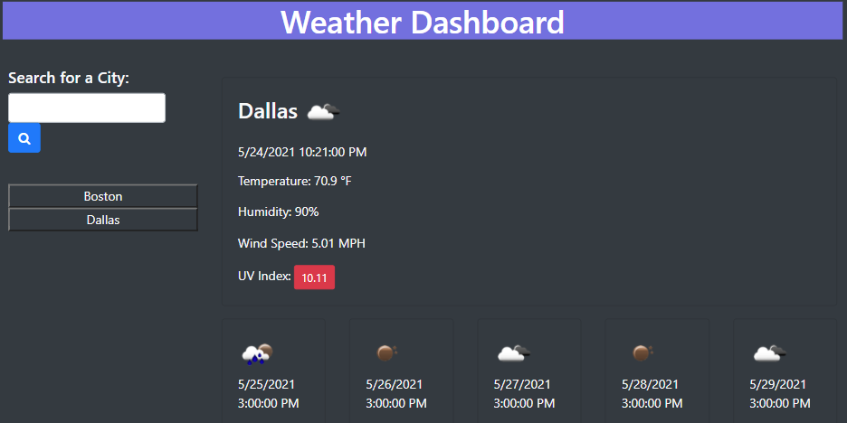

# Weather Dashboard

## Description:
    This is a weather dashboard that tells you the weather for a given area.

## HTML: 
    Contains divs that organize the information for the requested area.

## CSS:
    Bootstrap is doing most of the work for formatting but the gradient is found here.

## JS:
    Gets and displays search history as well as requests information from the OpenWeather API to give back to the user.

## Link: 
    https://jfig27.github.io/Weather-Dashboard/index.html

## Screenshots: 
